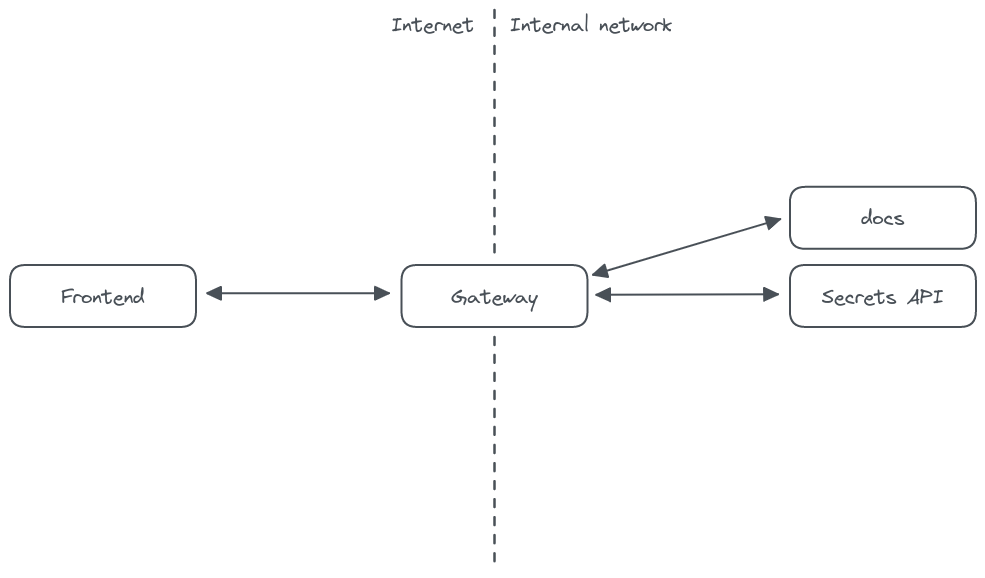

<h1 align=center>Keep Secrets</h1>
<p align=center>
  <br>
  <span><strong>KeepSecrets</strong> Project to share password and messages securely.<br />


</p>


## Native Installation

**NOTE**: NodeJS 16.x.x or higher is required.

```bash
# clone the repo
$ git clone https://github.com/EsteveSegura/keep-secrets

# change the working directory
$ cd keep-secrets

# install NodeJS if is not installed
$ cd src && yarn i && yarn start
```

## Docker Installation

If you want to run the project from docker or a portainer simply run the following docker-compose.yml

```yaml
version: "3.7"

services:
  api:
    image: girlazo/keep-secrets
    depends_on:
      - mongo
    ports:
      - 3002:3002
    command: yarn start
    networks:
      - keep-secrets
  mongo:
    image: mongo
    volumes:
      - ./data/mongo:/data/db
    ports:
      - "27017:27017"
    environment:
      MONGO_INITDB_ROOT_USERNAME: admin
      MONGO_INITDB_ROOT_PASSWORD: admin
    networks:
      - keep-secrets
networks:
  keep-secrets:
    name: keep-secrets
```

## Architecture

The architecture of keep-secrets follows a service approach, it does not follow a very focused approach where all services are small (microservices), it is intended to build services with several nested contexts, creating aggregates.

All calls are routed through a gateway which in turn has the ability to do some checks to remove that burden from the rest of the services.


## Usage

You can reach the frontend via browser

```
http://localhost:3002/
```

## License

MIT © Keep Secrets
